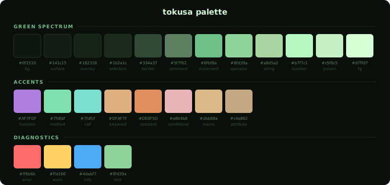

# 🌿 tokusa

木賊(tokusa) — Neovim用のダークグリーンカラースキーム

深い森の中にいるような、落ち着いた緑を基調とした配色です。
緑のグラデーションを軸に、オレンジやピンクのアクセントカラーで視認性を確保しています。

## Palette



## Features

- 深い緑を基調としたダークテーマ
- 12段階の緑のグラデーションによる自然な階調表現
- Treesitter対応のシンタックスハイライト
- 透過背景オプション (`transparent = true`)

### Supported Plugins

- [telescope.nvim](https://github.com/nvim-telescope/telescope.nvim)
- [gitsigns.nvim](https://github.com/lewis6991/gitsigns.nvim)
- LazyGit

## Installation

### lazy.nvim


```lua
{
  "aidyak/tokusa",
  lazy = false,
  priority = 1000,
  opts = {},
  config = function(_, opts)
    require("tokusa").setup(opts)
    vim.cmd.colorscheme("tokusa")
  end,
}
```

optsには[docs](https://github.com/aidyak/tokusa/tree/main/docs)配下のドキュメントを参照して値を入れてください

---

以下動作確認をしていないので、ご自身でトライしてみてください。
何が問題があればPRをください。

### packer.nvim

```lua
use {
  "aidyak/tokusa",
  config = function()
    vim.cmd.colorscheme("tokusa")
  end,
}
```

### vim-plug

```vim
Plug 'aidyak/tokusa'

" After plug#end()
colorscheme tokusa
```

### dein.vim

```vim
call dein#add('aidyak/tokusa')

" In your config
colorscheme tokusa
```

### mini.deps

```lua
MiniDeps.add({ source = "aidyak/tokusa" })
vim.cmd.colorscheme("tokusa")
```

### Manual

```bash
git clone https://github.com/aidyak/tokusa ~/.local/share/nvim/site/pack/plugins/start/tokusa
```

Then add to your config:

```lua
vim.cmd.colorscheme("tokusa")
```
